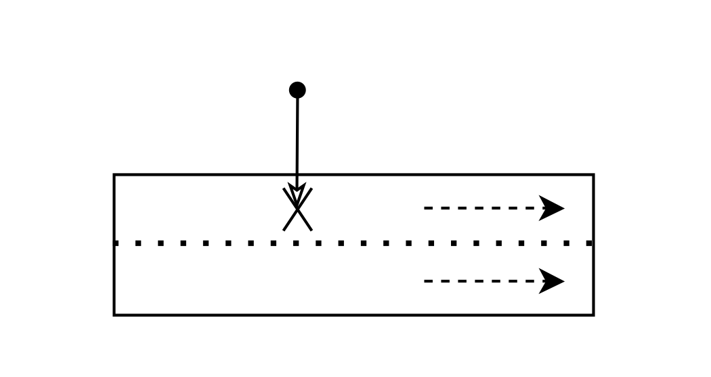
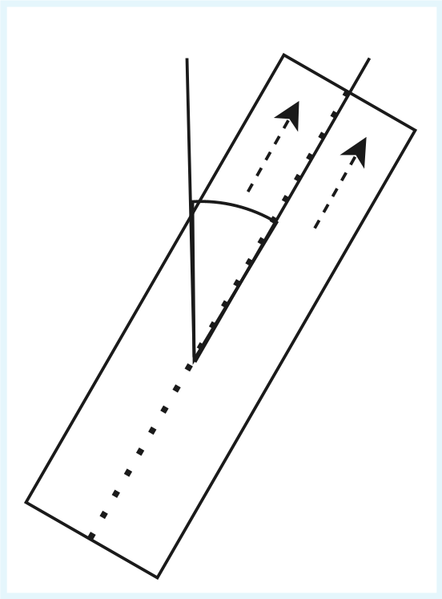
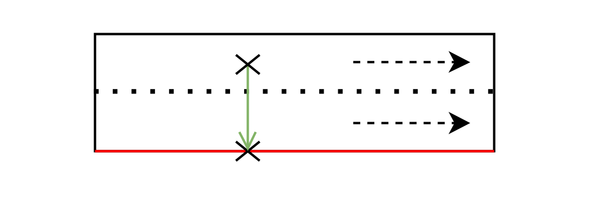
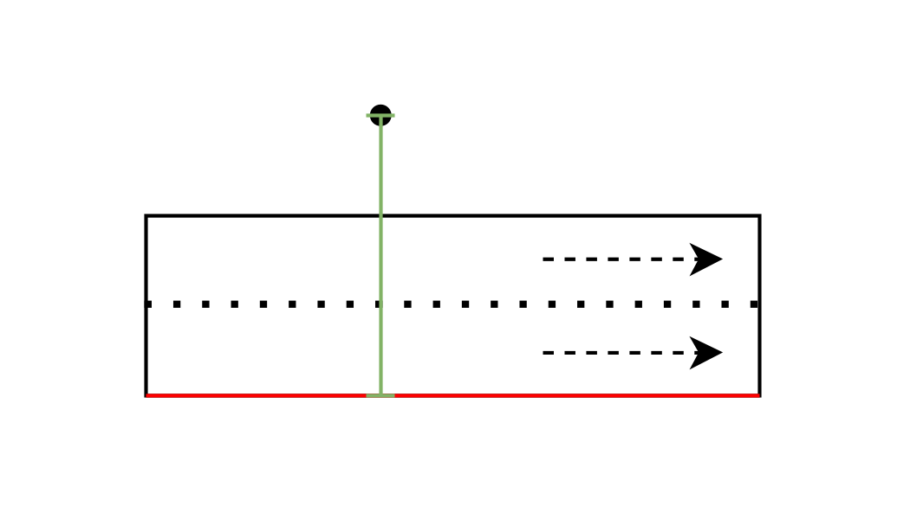
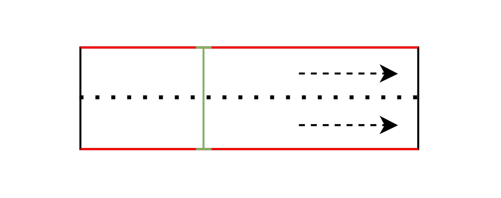
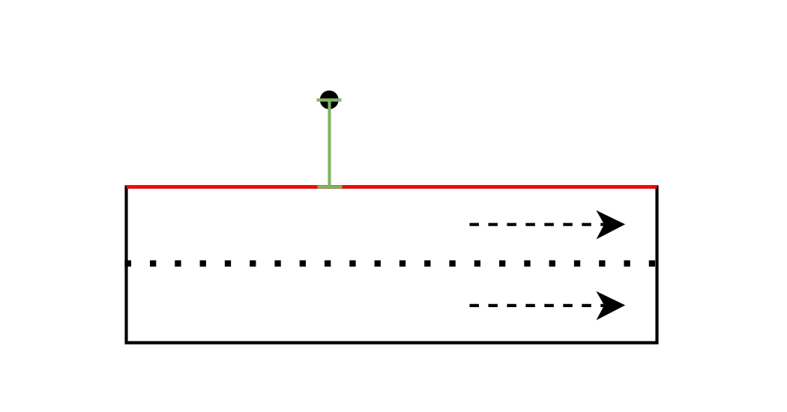

# Data Enrichment

Calculates the **distance to the nearest road edge** (`distance_to_road_edge`) for each message. This information is essential for the **Position Plausibility Check**.

## Algorithm

<p align="center">
   <br>
   <em> 1. Get position of the nearest lane </em>
</p>
<br>

<p align="center">
   <br>
   <em> 2. Get heading of the lane   </em>
</p>
<br>

<p align="center">
   <br>
   <em> 3. Calculate road center (considering all lanes)
 </em>
</p>
<br>

<p align="center">
   <br>
   <em> 4. Calculate distance from position to road center
 </em>
</p>
<br>

<p align="center">
   <br>
   <em> 5. Calculate the total width of the street (one direction)
 </em>
</p>
<br>

<p align="center">
   <br>
   <em> 6. Add total width to the distance from the car to the middle
 </em>
</p>

---

## TraCI Functions

| Function                              | Usage                       |
|---------------------------------------|-----------------------------|
| `traci.simulation.convertRoad(x, y)`  | Position → Edge/Lane        |
| `traci.edge.getShape(edge_id)`        | Edge geometry               |
| `traci.lane.getWidth(lane_id)`        | Lane width                  |
| `traci.edge.getAngle(edge_id, pos)`   | Heading direction           |
| `traci.simulation.convert2D(...)`     | Edge position → Coordinates |
| `traci.simulation.getDistance2D(...)` | Calculate distance          |

## Parallelization

- Starts N SUMO instances on different ports (8873 + worker_id)
- Each worker processes a chunk of JSON files
- One SUMO instance per worker (avoids reconnects)

## Output

Modifies JSON files in-place. Adds:

```json
{
  "sender": {
    "distance_to_road_edge": 3.5,
    ...
  }
}
```

## Error Handling

- Fallback when `convertRoad` fails: `getNeighboringEdges` within 500m radius
- On complete failure: `distance = 0`
- Failed files are logged
