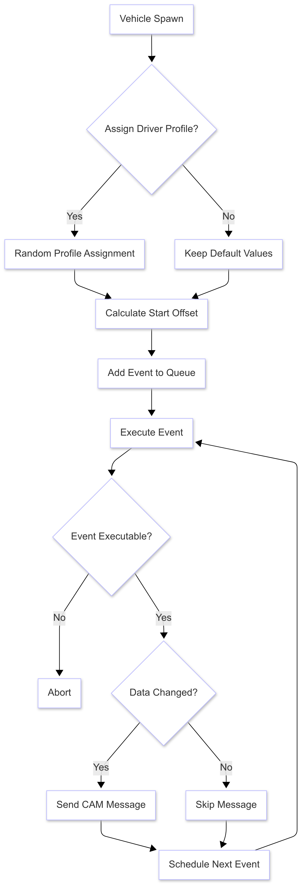
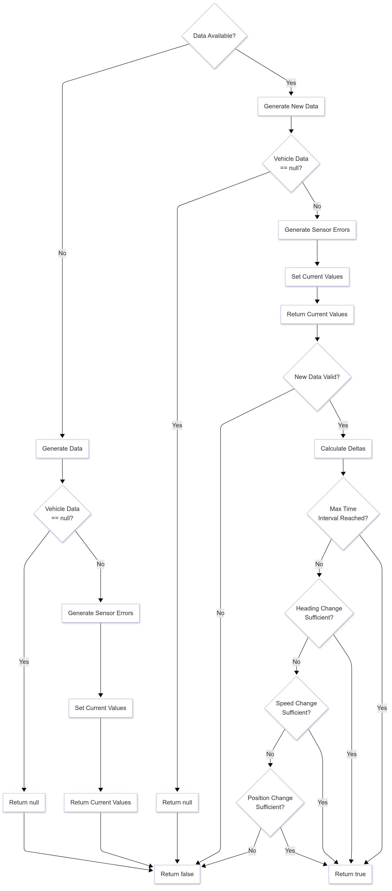
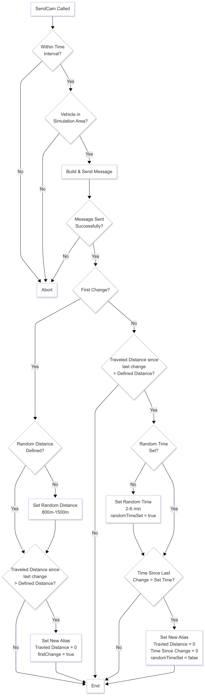
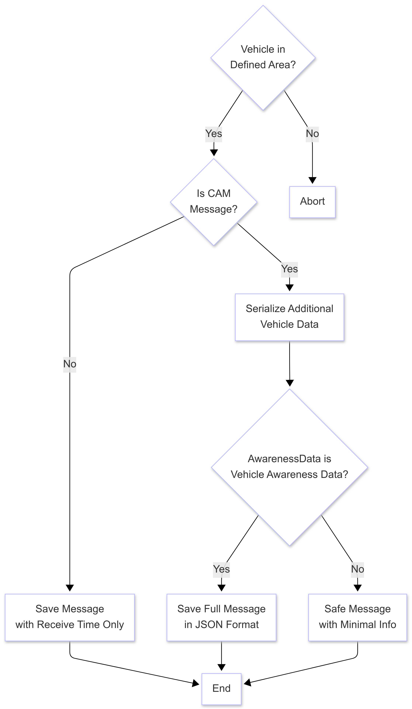

# Processes

Documentation of processes occurring during the simulation.

## Complete-Process
 

    
   <em> Complete process from Vehicle spawn to sending messages. Consist of different sub processes like the "data change" 
    - process or the "send CAM" - process. </em>

 

## Data Changed-Process

 

    
   <em> Process of deciding if a message is supposed to be sent. This gets decided by multiple factors. True means a 
    message should be sent and false that this one should be skipped. </em>

 

## Send CAM
 

    
   <em> Process after the "data changed" - process returned true. It includes the decision if the simulation time is in the 
    defined range and the vehicle is in rhe correct area. Further the pseudonym change is coordinated right after 
    the message was successfully send.</em>

 

## Receive Message-Process
 

    
   <em> Process after a message is received by another vehicle. Includes the check if the received message has the right format among others.</em>

 